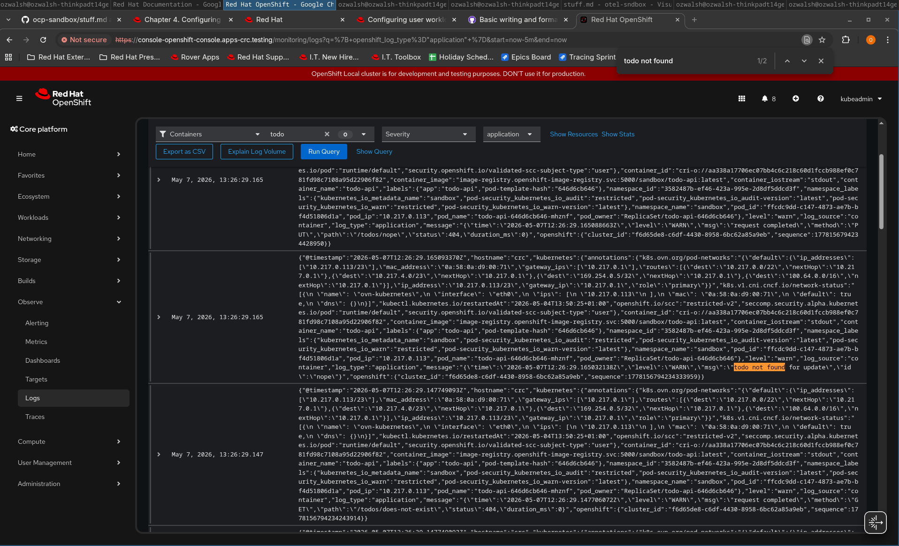

# Explore OpenShift
* OpenShift Version: v4.21.8
* Storage Backend: seaweedfs (S3 compatible)
* Red Hat build of OpenTelemetry version: 3.9
* MailPit to capture alertmanager email alerts.

* Install OpenShift local on your company provided laptop

You can install CRC using the guide here: https://crc.dev/docs/installing/

You can start CRC using optimal resources for the observability stack using the script in [`scripts/start-crc`](./scripts/start-crc).

You can verify the installation by running `crc status`:
```bash
ozwalsh@ozwalsh-thinkpadt14gen4:~$ crc status
CRC VM:          Running
OpenShift:       Running (v4.21.8)
RAM Usage:       19.07GB of 25.19GB
Disk Usage:      41.65GB of 267.8GB (Inside the CRC VM)
Cache Usage:     94.2GB
Cache Directory: /home/ozwalsh/.crc/cache
```

* Ensure that OpenShift local has monitoring enabled (in-cluster and user workload monitoring) and that it is configured to use logging (Vector & Loki)

OpenShift includes core platform monitoring out of the box. You also have the option to enable user workload monitoring to monitor your own projects[^1].

To enable the user workload monitoring follow this guide: [https://docs.redhat.com/en/documentation/monitoring_stack_for_red_hat_openshift/4.21/html-single/configuring_user_workload_monitoring/index#enabling-monitoring-for-user-defined-projects_preparing-to-configure-the-monitoring-stack-uwm](https://docs.redhat.com/en/documentation/monitoring_stack_for_red_hat_openshift/4.21/html-single/configuring_user_workload_monitoring/index#enabling-monitoring-for-user-defined-projects_preparing-to-configure-the-monitoring-stack-uwm)

1. Add a `ConfigMap` to the `cluster-monitoring` namespace like here [`manifests/cluster/configmap-cluster-monitoring-config.yaml`](./manifests/cluster/configmap-cluster-monitoring-config.yaml)
2. Wait a bit. You should see the following pods created in the `openshift-user-workload-monitoring` namespace.
```bash
ozwalsh@ozwalsh-thinkpadt14gen4:~/dev/otel-sndbox$ oc -n openshift-user-workload-monitoring get pods
NAME                                   READY   STATUS    RESTARTS   AGE
prometheus-operator-76dbbd9569-f9rgh   2/2     Running   6          2d23h
prometheus-user-workload-0             6/6     Running   18         2d23h
thanos-ruler-user-workload-0           4/4     Running   12         2d23h
```

To do the installation on your CRC cluster we first need to apply the subscription to install the loki-operator.

File: [`./manifests/operator/subscription-openshift-operators-redhat.yaml`](./manifests/operator/subscription-openshift-operators-redhat.yaml)

Next we need to prepare an s3 compatible backend for Loki. This repo utilizes SeaweedFS for this purpose.
1. Deploy SeaweedFS: [`manifests/workloads/statefulset-seedweedfs-s3.yaml`](./manifests/workloads/statefulset-seedweedfs-s3.yaml)
2. Create a secret containing the credentials for s3: [`manifests/operator/secret-logging-loki-s3.yaml`](./manifests/operator/secret-logging-loki-s3.yaml)
3. Create a LokiStack: [`manifests/workloads/lokistack-logging-loki.yaml`](./manifests/workloads/lokistack-logging-loki.yaml)

Your `openshift-logging` namespace should look like this:
```bash
ozwalsh@ozwalsh-thinkpadt14gen4:~$ kubectl -n openshift-logging get pods
NAME                                          READY   STATUS    RESTARTS       AGE
cluster-logging-operator-77bfb75c76-vghlt     1/1     Running   2              2d
instance-xdxtg                                1/1     Running   2              2d
logging-loki-compactor-0                      1/1     Running   11 (21h ago)   2d
logging-loki-distributor-748b788dcd-m7zv8     1/1     Running   2              2d
logging-loki-gateway-6696d6f469-kjshc         2/2     Running   4              2d
logging-loki-gateway-6696d6f469-rgbxm         2/2     Running   4              2d
logging-loki-index-gateway-0                  1/1     Running   2              2d
logging-loki-ingester-0                       1/1     Running   2              2d
logging-loki-querier-76997b458b-j4c6d         1/1     Running   2              2d
logging-loki-query-frontend-ff69bc95f-rpqdw   1/1     Running   2              2d
```

* Create a simple web application that will expose custom metrics in the Prometheus format and output logs.
todo-api is a simple app instrumented using the prometheus golang instrumentation library. It exposes a `/metrics` endpoint.

It outputs structured logs to stdout using `log/slog`.

File: [`todo-api/main.go`](./todo-api/main.go)

Initially, a `ServiceMonitor` was added directly to the todo-api deployment manifest to have OpenShift's user-workload Prometheus scrape the `/metrics` endpoint. This was later removed when the OTel collector took over scraping — see the [removal commit](https://github.com/ozzywalsh/ocp-sandbox/commit/d8c6973#diff-3bf7405035cac2068f29b25826891ce511d2ea6f3e56cebdbbaebb45f18e3099).

* Ensure you can access logs and custom metrics in the OpenShift console for your application. For logs, ensure you are using the Loki based logging console page.

First install the cluster observability-operator by adding the relevant OLM resources; subscription, operatorgroup etc.

File: [`./manifests/operator/subscription-cluster-observability.yaml`](./manifests/operator/subscription-cluster-observability.yaml)

Create a LokiStack.
File: [`./manifests/workloads/lokistack-logging.yaml`]

Add a `ClusterLogForwarder` CR to get your application logs into the logging stack.

Install the logging UI plugin by applying the following resource to your cluster [`manifests/workloads/uiplugin-logging.yaml`](./manifests/workloads/uiplugin-logging.yaml)


To get the admin credentials for the web console run:
```bash
crc console --credentials
```
Then use the kubeadmin user and the output password to login here: https://console-openshift-console.apps-crc.testing/

Navigate to the Observe -> Logs and you should the the logging ui like below. 




* Install OpenTelemetry

To install the opentelemetry-operator add the relevant OLM resources; subscription, operatorgroup etc.

Docs: https://docs.redhat.com/en/documentation/red_hat_build_of_opentelemetry/3.9/html/installing_red_hat_build_of_opentelemetry/install-otel
File: [`./manifests/operator/subscription-opentelemetry-product.yaml`](./manifests/operator/subscription-opentelemetry-product.yaml)

This should result in:
```bash
ozwalsh@ozwalsh-thinkpadt14gen4:~/dev/otel-sndbox$ kubectl -n openshift-opentelemetry-operator get pods
NAME                                                         READY   STATUS    RESTARTS      AGE
opentelemetry-operator-controller-manager-86cbd7f9dc-hfpdk   1/1     Running   6 (21h ago)   2d
```

* Configure your OpenTelemetry collector so that it will read the metrics endpoint instead of the OpenShift Prometheus (the metrics endpoint should still be in the prometheus format, but scraped by the OTEL collector and not by the OpenShift Prometheus). Add an extra label to your metrics using the Collector and make sure that Collector is adding the right metadata for an application running in OpenShift/Kubernetes (you may need a processor to help with this). Ensure that you can see your metrics (with extra labels) in the OpenShift console.

To fulfill this step we must first create an `OpenTelemetryCollector` CR configured with the `prometheus` receiver. We must also add a processor to add the appropriate labels to the metrics.

File: [`./manifests/workloads/opentelemetrycollector-otel.yaml`](./manifests/workloads/opentelemetrycollector-otel.yaml).

* Update your application so that it uses OTLP metrics and logs. This will require updating your application to use the OpenTelemetry instrumentation libraries instead of the Prometheus one. Both the logs and metrics should be going through the OpenTelemetry collector. Ensure that you can see these metrics and logs in the OpenShift Console.

* Install Distributed Tracing in the OpenShift console and update your simple application so that a request goes through multiple different services.

Instrument your application for tracing (autoinstrumentation is fine, but please do so at build time). Ensure that you can now access your OTEL metrics, logs and traces in the OpenShift console.

Remove the instrumentation libraries for your application. This time use the OpenTelemetry Operator to inject auto-instrumentation into your application. Ensure you can access the logs, metrics and traces in the OpenShift Console.

* Checkout the OpenTelemetry Operator and Collector code bases. Ensure that you can build these components locally on your machine.

Clone this repo (otel repo). Follow the contributing.md. Link pull requests.

Deploy these locally built products into your OpenShift Local cluster. Make a small change to the Operator and Collector to ensure that you are deploying this new version.

[^1]: https://docs.redhat.com/en/documentation/monitoring_stack_for_red_hat_openshift/4.21/html/about_monitoring/about-ocp-monitoring